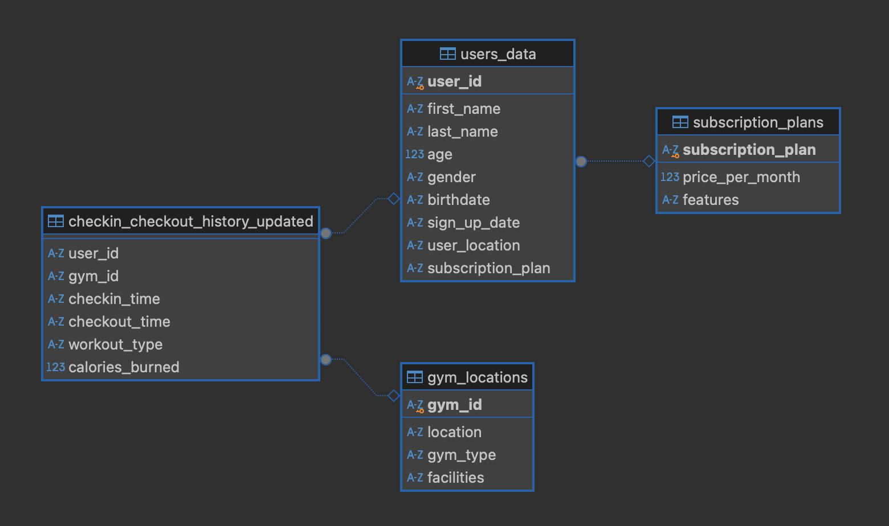

# Gym Analysis SQL

This project is part of my SQL course in the Data Science program. It involves analyzing a publicly available dataset from [Kaggle](https://www.kaggle.com/datasets/mexwell/gym-check-ins-and-user-metadata) using basic SQL queries in SQLite. The dataset includes user metadata and check-in data for various gym locations. The goal is to extract insights into gym revenue, member demographics, workout habits, and engagement based on subscription plans.

## Project Goals

The main objectives of this analysis are:

1. **Calculate the yearly revenue per gym location** based on user subscriptions.
2. **Analyze gym member demographics**, including age and gender distribution.
3. **Identify gym locations with the best athletes**—members who burn more calories than average.
4. **Determine average workout duration** by workout type.
5. **Evaluate engagement levels** for different subscription plans.

These insights aim to help the gym corporation make data-driven decisions regarding gym operations, marketing strategies, and membership plans.

## Data Structure

The dataset consists of several related tables that contain user metadata, gym location details, and check-in records. Here's the ERD:

---

## SQL Queries and Insights

The following queries were written to answer analysis questions.

### 1. **Yearly Revenue per Location**

- This query calculates the yearly revenue for each gym location by multiplying the monthly subscription price (`price_per_month`) by the number of users at each location, and then multiplying by 12 to get the total yearly revenue.
- Locations with higher membership counts or more expensive subscription plans contribute more significantly to overall revenue.
- This can be valuable to understand which gym locations are the most profitable, and where resources or marketing efforts could be focused to increase revenue.

### 2. **Demographics of Gym Members**

- This query groups gym members by age and gender, then counts the number of members in each age group.
- The largest age group is typically between 18-25 years, suggesting that gyms tend to attract a younger demographic.
- The gender distribution shows differences across age groups, which indicates that some age groups are more likely to have a certain gender representation.
- This info is useful to tailor marketing strategies and gym services to specific demographic groups.

### 3. **Top Locations with Best Athletes (Above Average Calories Burned)**

- This query identifies gym locations where the average calories burned by members is higher than the overall average across all locations.
- It can be useful to identify locations that are more likely to appeal to fitness enthusiasts or those looking to achieve higher workout intensity.
- This insight may help with decision-making regarding gym-specific marketing strategies, such as promoting certain workout classes or focusing on high-intensity training programs in high-calorie-burning locations.

### 4. **Average Workout Duration per Workout Type**

- This query calculates the average duration of workouts in minutes for each workout type by finding the difference between check-in and check-out times.
- Weightlifting tends to have a longer average duration compared to cardio workouts, suggesting that members spend more time on strength training exercises.
- This insight is valuable for understanding member preferences and behaviors in terms of workout types, which can inform decisions on equipment allocation or class scheduling.

### 5. **Engagement per Subscription Plan**

- This query counts the number of check-ins for each subscription plan, providing a measure of user engagement.
- The higher engagement of premium users suggests that members who invest in more expensive plans are likely more committed to their fitness routines.
- This insight can help the gym identify which subscription plans are most effective at keeping members active, and could inform decisions around pricing, marketing, or offering incentives to encourage engagement from lower-tier plans.

## Conclusion

This project provided valuable insights into gym operations and member behavior using SQL queries. By analyzing the data, we were able to answer key questions about revenue, member demographics, workout habits, and engagement. Overall, these insights can help gym management make data-driven decisions about marketing, membership plans, and program offerings to improve engagement and revenue.

